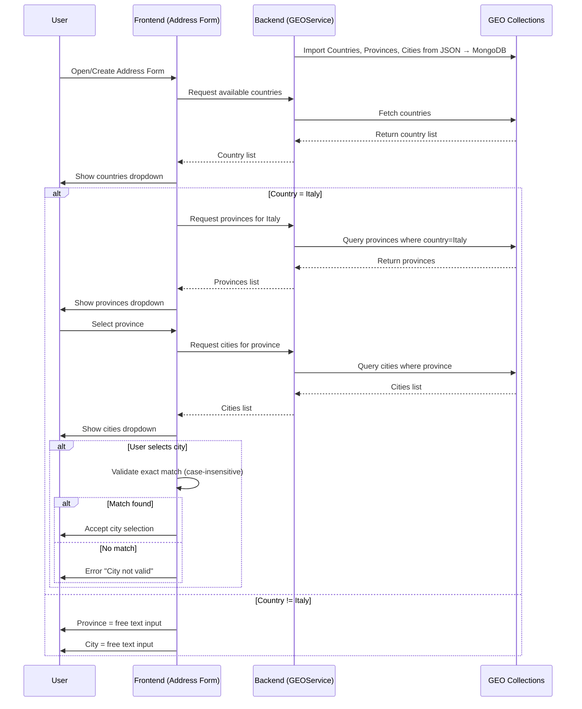

# Customer Management System - Comprehensive Technical Documentation

## Table of Contents

1. [Personal Data & Fiscal Code Validation](#1-personal-data--fiscal-code-validation)
2. [Duplicate Detection & Blacklist Rules](#2-duplicate-detection--blacklist-rules)
3. [Mobile Verification](#3-mobile-verification)
4. [Email Verification](#4-email-verification)
5. [Blocking Rules & Submission Flow](#5-blocking-rules--submission-flow)
6. [Document Upload & Mobile Capture](#6-document-upload--mobile-capture)
7. [Complete End-to-End Flow](#7-complete-end-to-end-flow)

---

## 1. Personal Data & Fiscal Code Validation

### 1.1 Country-Based Conditional Logic

#### If ADDRESS Country = Italy

- Show input field: **Fiscal Code** - all parsed input should be **Read-Only**
- **If parse Fiscal Code == Italy:**
  - Hide manual personal data inputs (country of birth, place of birth, province of birth)
  - When Fiscal Code is entered → system **parses the fiscal code** and auto-fills personal data:
    - Country of birth → Italy (auto-selected)
    - Place of birth → Dropdown populated from DB (cities)
    - Province of birth → Dropdown populated from DB (provinces)
    - Date of birth → extracted from fiscal code
    - Gender → extracted from fiscal code
- **If parse Fiscal Code ≠ Italy:**
  - Hide manual personal data inputs
  - When Fiscal Code is entered → system **parses the fiscal code** and auto-fills personal data:
    - Country of birth → Austria (auto-selected) and province should === EE or ES
    - Place of birth → text and == the country
    - Date of birth → extracted from fiscal code
    - Gender → extracted from fiscal code

#### If Country ≠ Italy

- Fiscal Code is not required and hidden
- Show **manual personal data inputs** and add data manually

### 1.2 Fiscal Code Validation Rules

- **Rule 1 – Format Validation:**
  - Check if Fiscal Code is structurally valid
  - If invalid → `{ type: "fiscalCode", message: "Fiscal Code not valid" }`
- **Rule 2 – Name Consistency (Blocking):**
  - Compare **FirstName** & **LastName** (user input) with parsed values
  - If mismatch → block submission
  - Error response: `{ "type": "fiscalCode", "message": "First/Last name do not match fiscal code." }`
- **Rule 3 – Synchronization Watcher:**
  - Any change in `fiscalCode`, `firstName`, or `lastName` triggers re-validation
- **Rule 4 – DB Lookup Validation:**
  - Province/City codes from Fiscal Code must match DB records
  - If lookup fails → fallback empty dropdown, user must select manually

### 1.3 Frontend Form Behavior

1. **User selects country** → conditionally renders inputs:
   - Italy → Fiscal Code input only
   - Other → manual fields
2. **User types Fiscal Code (Italy case only)** → triggers:
   - Parse fiscal code
   - Autofill derived fields (DOB, gender, place, province)
   - Cross-check first/last name
3. **User edits manual fields (Non-Italy case)** → free text or dropdowns where applicable

### 1.4 Backend Responsibilities

1. **Fiscal Code Parsing Service**
   - Input: Fiscal Code
   - Output: `{ firstName, lastName, gender, dateOfBirth, placeOfBirth, provinceOfBirth }`
   - Validation logic must ensure integrity with user-entered names
2. **Consistency Enforcement**
   - If mismatch detected between fiscal code & names → reject submission
   - Store both raw fiscal code and parsed data in DB

### 1.5 Error Handling

- **Invalid Fiscal Code** → show error "Fiscal Code not valid"
- **Mismatch** between `firstName`/`lastName` vs parsed code → block submission
- **Missing DOB/Gender inside code** (rare edge case) → ask user to fill manually
- **If DB lookup fails** for province/city → fallback to empty dropdown

---

## 2. Duplicate Detection & Blacklist Rules

### 2.1 Real-Time Duplicate Check Flow

#### User Initiates Customer Creation

- User opens the **Create Customer** form in the Angular frontend
- All required fields are filled in (name, email, phone, address, etc.)

#### Frontend Real-Time Duplicate Check

- When the **Create Customer** form is opened, frontend generates a **TempId** for the customer and establishes a **socket connection**
- As the user types, the socket triggers real-time duplicate or blacklist checks via the **check_rule** event
- Frontend sends the form values with the **TempId** to the backend over the socket
- Backend evaluates the data against **Duplicate Detection** and **Blacklist Rules**:
  - **Duplicate Rules**: Based on field combinations (e.g., email + phone, name + address)
  - **Blacklist Rules**: Based on specific field values matching predefined conditions

#### Backend Duplicate & Blacklist Rule Evaluation

- Backend **caches all rules** on system startup since they are rarely modified
- Upon receiving data, backend checks customer details against **existing customers** in the database
- This check uses the **$all operator** on an indexed `values` key for efficient search

**Example Event Request:**

```typescript
checkRules(EVENT): {
  "id": "<tempId or realId>",
  "form-value": {...},
  "page": 1,
  "rpp": 20,
  "ignoreCache": true,
  "ruleType": "DUPLICATION" | "BLACKLIST",
  "ruleId": "<ruleId>"
}
```

**Example Event Response:**

```typescript
{
  "blacklist": [
    { "RULE_OBJECT": {...} },
    { "RULE_OBJECT": {...} }
  ],
  "duplication": [
    {
      "rule": { ... },
      "records": [ ... ],
      "totalCount": 5
    },
    {
      "rule": { ... },
      "records": [ ... ],
      "totalCount": 5
    }
  ]
}
```

### 2.2 Results Handling

#### If duplicates are found:

- Backend returns the **matching customer(s)** along with the **rule that triggered the match**
- Backend stores the triggered duplication rule in a **temporary cache** linked to the TempId
- Cache entry is removed once creation succeeds, or automatically cleared by **cron job every 24h**
- Frontend displays the detected matches to the user
- User can choose to:
  - **Cancel** creation (navigate to the matched profile or review the rule)
  - **Proceed anyway** (continue editing)

#### Proceeding with Customer Creation

- Before final submission, system re-checks and retrieves all rules again:
  - **Duplicate rules** are displayed in a popup containing two accordions:
    1. A list of the triggered rules
    2. A list of the matched customer records
  - **Blacklist rules** are shown as separate sequential popups
- If user confirms creation with **no disallowed duplication**:
  - Backend ensures there are **no blocking rules**
  - **TempId / cache entry** helps prevent race conditions
  - If everything is valid, process continues to next step (mobile or email verification)
- If user attempts to confirm with a **disallowed duplication**:
  - Popup shown explaining that customer cannot be created, along with the **duplication rule** that caused the block

---

## 3. Mobile Verification

### 3.1 Mobile Verification Collection

**Collection: `mobile_verifications` (Temporary)**

- `mobileNumber` (string)
- `verificationCode` (OTP, string)
- `tempCustomerId` (string → links to customer creation session)
- `status` (e.g., PENDING, VERIFIED, EXPIRED)
- `createdAt`, `expiresAt`

> Purpose: hold verification data temporarily until customer is created successfully

### 3.2 Events & Lifecycle

#### Step 1: Send OTP

- **Frontend Action:**
  - User enters mobile number in form
  - Triggers **`sendOtp` event** through socket/API
- **Backend Action:**
  - Generate OTP (e.g., 6-digit code)
  - Save entry in `mobile_verifications` collection with status = `PENDING`
  - Send OTP via SMS provider
- **Result:** User receives OTP

#### Step 2: Verify OTP

- **Frontend Action:**
  - User enters OTP in verification field
  - Triggers **`verifyOtp` event**
- **Backend Action:**
  - Look up entry in `mobile_verifications` by `mobileNumber` + `tempCustomerId`
  - Check if OTP matches and not expired
    - If valid → update status = `VERIFIED`
    - If invalid/expired → return error

#### Step 3: OTP Expiry

- OTP codes expire after a defined time (e.g., 5 minutes)
- Expired codes are either:
  - Deleted by cron job
  - Or status updated to `EXPIRED`
- If expired → user must re-trigger **sendOtp** to get a new code

#### Step 4: Customer Creation

- Once customer creation is successful:
  - Backend copies verified mobile number from `mobile_verifications` to the **Customer Collection**
  - Deletes the corresponding entry in `mobile_verifications`
- If the OTP is required and is not set you can't submit, and get the error into popup

### 3.3 Backend Responsibilities

- **Generate & Send OTP** securely (random, time-limited)
- **Rate limiting**: prevent abuse (e.g., max 3 OTP sends in 10 minutes)
- **Temporary storage** in `mobile_verifications`
- **Final migration** of verified mobile number into `customers` collection
- **Cleanup:**
  - On success → delete temp entry immediately
  - On failure → auto-delete after TTL (24h)

### 3.4 Error Handling

- If mobile already exists in another verified customer → reject creation (duplication rule)
- If OTP expired → show "OTP expired, please request a new one"
- If OTP incorrect → show "Invalid code"
- If SMS provider failure → show "Failed to send OTP, try again later"
- If OTP is required and still not verified → show verify mobile number

---

## 4. Email Verification

### 4.1 Email Verification Collection

**Collection: `email_verifications` (Temporary)**

- `email` (string)
- `verificationCode` (OTP)
- `secretToken` (string – unique UUID or hash)
- `tempCustomerId` (string)
- `status` (PENDING, VERIFIED, EXPIRED)
- `createdAt`, `expiresAt`

### 4.2 Events & Lifecycle

#### Step 1: Send OTP + Secret Token

- **Frontend Action:**
  - User enters email address
  - Triggers **`sendEmailOtp` event**
- **Backend Action:**
  - Generate OTP (e.g., 6-digit code)
  - Generate `secretToken` (UUID or secure hash)
  - Save entry in `email_verifications` collection with status = `PENDING`
  - Send email with:
    1. OTP code (user can enter manually)
    2. Verification link with `secretToken` (auto-verifies when clicked)

#### Step 2: Verify via OTP (manual method)

- **Frontend Action:**
  - User enters OTP in verification field
  - Triggers **`verifyEmailOtp` event**
- **Backend Action:**
  - Lookup by `email + tempCustomerId`
  - Validate OTP & expiry
  - If valid → update status = `VERIFIED`

#### Step 3: Verify via Secret Token (link method)

- **User clicks email link:**
  - URL contains `secretToken`
  - Frontend calls backend API: `GET /verify-email?token=xxxxx`
- **Backend Action:**
  - Lookup by `secretToken` in temp email-collection if not found search in customers collection
  - If found & not expired → mark status = `VERIFIED`
  - Redirect user to confirmation page → "Email Verified Successfully"

#### Step 4: Real-time Notification

- Once email is verified (via OTP or secret token):
  - Backend emits **`emailVerified` event** via socket
  - Frontend updates UI instantly: "✅ Email Verified"

#### Step 5: Expiry & Cleanup

- OTP & secret token expire after configured time (e.g., 24h)
- Expired records are deleted by cron job
- On customer creation success → verified email copied into `customers` collection, temp record deleted

### 4.3 Backend Responsibilities

- **Generate & store OTP + secretToken** securely
- **Send Email** with both OTP & verification link
- **Verify methods**: OTP or Token (both lead to same result = VERIFIED)
- **Emit real-time event** via socket on success
- **Cleanup**: delete temp verification after success or TTL expiry

### 4.4 Error Handling

- **Invalid OTP** → show "Invalid code"
- **Expired OTP/Token** → show "Link expired, request new verification"
- **Already verified** → show "Email already verified"
- **Email sending failure** → show "Could not send verification email"

---

## 5. Blocking Rules & Submission Flow

### 5.1 Trigger Point: Submit Action

**When:** User presses **Submit** in Create/Update Customer form

**Frontend:**

- Collect all form values + `tempCustomerId` (for create) or `customerId` (for update)
- Run **blocking rules** sequentially (basic checks inline)
- If any rule fails → stop submission, show popup

**Backend:**

- Run same rules in sequence
- If all pass → save/update customer, clear temp data, emit `customerSaved`

### 5.2 Blocking Rule Types

#### Rule 1: Duplication Blocking

- **Check:** If potential duplicates exist
- **Frontend:** Show duplicates popup with virtual scrolling/pagination
- **Backend:** Query DB using duplication rules (`$all` filter). If blocking → stop save

#### Rule 2: Email & Mobile Verification Blocking

- **Rule Config:** `isEmailVerificationRequired`, `isMobileVerificationRequired`
- **Backend:** If required and `status != VERIFIED` in `email_verifications` or `mobile_verifications`:
  - Return error: `{ type: "verification", fields: ["email", "mobile"] }`
- **Frontend:** Popup: ⚠️ "Please verify email/mobile before continuing." Verification action UI should appear until verified

#### Rule 3: Convalidation Blocking

**Purpose:** Manual human validation for sensitive fields

**Flow:**

1. **Frontend** → sends:

```typescript
{
  event: "startConvalidation",
  payload: {
    tempCustomerId,
    fields: { firstName, lastName, address, ... }
  }
}
```

2. **Backend:**
   - Save record in `convalidation_data`:

```typescript
{
  id: "ID",
  customerId: "temp/real",
  fields: [
    { "key": "firstName", "value": "Mario" },
    { "key": "lastName", "value": "Rossi" }
  ],
  state: "initial"
}
```

- Send FCM notification → Internal User app
- Send event to frontend `startConvalidation` that will show message in popup

3. **Internal User:**

   - Marks state → `state=valid | invalid`
   - Updates DB
   - Backend emits `convalidationUpdate` via socket

4. **Frontend:**
   - If `state=valid` → loader → ✅ check mark → continue save
   - If `state=invalid` → show popup "Please correct fields", user edits → restart validation flow again (duplication & blacklist → verification → convalidation)

### 5.3 Convalidation State Machine

```typescript
enum EConvalidationState {
  initial, // just created
  valid, // all fields verified & correct
  invalid, // at least one field incorrect
}
```

**Record Example:**

```typescript
{
  "id": "conval-123",
  "customerId": "temp-001",
  "fields": [
    { "key": "firstName", "value": "Mario" },
    { "key": "lastName", "value": "Rossi" }
  ],
  "state": "initial"
}
```

**Transition:**

- `initial → valid` if all fields are verified and correct
- `initial → invalid` if any field incorrect
- If `invalid` → user must correct → re-run all blocking rules again

### 5.4 Error Handling

- **Duplication** → "Customer already exists."
- **Verification missing** → "Please verify email/mobile."
- **Convalidation fail** → "Following fields need correction."

### 5.5 Final Save

Only when **all rules pass:**

- Backend saves in `customers` collection
- Clear temp data (duplication cache, verifications, convalidation records)
- Emit `customerSaved` → Frontend updates UI, navigate to list

---

## 6. Document Upload & Mobile Capture

### 6.1 Document Types Setup

- **Predefined Document Types** (e.g., ID Card, Driver License, Passport, Additional Documents)
- Source: **JSON file provided by company**
- Save in:
  - Either a **collection `document_types`** in DB
  - Or as **Enums** in codebase
- **Frontend:** Dropdown in upload form → shows available document types

### 6.2 Document Collection Structure

**Collection: `documents`**

- `customerId` (string, reference to customer)
- `documentType` (enum/string from predefined list)
- `fileUrl` (uploaded file path or base64)
- `status` (e.g., PENDING, APPROVED, REJECTED)
- `uploadedAt`
- `uploadedBy` (manual upload / mobile device capture)

### 6.3 Upload Flow

#### Step 1: Standard Upload

- User selects document type + file from device
- Uploads via Uploader Component
- Backend stores in `documents` collection and returns record
- Uploader component displays uploaded doc in real-time list

#### Step 2: Enhanced Upload Component

- Uploader Component supports:
  - Array of Buttons (actions)
  - Each button has a **callback function** triggered on `onClick`
  - Example buttons:
    - "Upload from device"
    - "Take photo by mobile phone"

#### Step 3: Take Photo by Mobile Phone / Device

- **Frontend Action:**
  - User clicks **"Take Photo by Mobile Phone"** button
  - Triggers **`requestMobilePhoto` event** via socket → sent to backend
- **Backend Action:**
  - Receives event with `tempCustomerId` + `documentType`
  - Sends **FCM notification** to all devices of the logged-in user:
    - Notification contains request: "Capture document photo"
- **Mobile Device Action:**
  - User receives push notification
  - Opens camera → captures photo
  - Uploads directly to backend with metadata (`tempCustomerId`, `documentType`)
- **Backend Save:**
  - Stores document in `documents` collection
  - Notifies frontend in **real-time (socket event)** with new record
- **Frontend Update:**
  - Uploader Component receives socket event
  - Adds document live to list (without refresh)

### 6.4 Real-time Sync

- All document uploads (manual or mobile capture) must trigger a **socket event** back to frontend
- Ensures documents appear live in Uploader Component

### 6.5 Validation

- Each document type may require **mandatory validation** or be **optional**
- Validation errors appear **at the top of the uploader component**
- Validation is dynamic based on **document rules**
- If related inputs are dirty (filled), validation must be rechecked

### 6.6 Error Handling

- **Device not responding** → show "No device available to capture photo"
- **Upload failed** → show "Upload failed, please try again"
- **Invalid document type** → reject with error
- **Customer not found** → reject with error

---

## 7. Complete End-to-End Flow

### 7.1 Master Sequence Diagram

```mermaid
sequenceDiagram
    participant U as User
    participant F as Frontend
    participant B as Backend
    participant DB as Database
    participant SMS as SMS Provider
    participant Email as Email Service
    participant Internal as Internal User
    participant Mobile as Mobile Device

    %% === PHASE 1: FORM INITIALIZATION ===
    U->>F: Open Create Customer Form
    F->>F: Generate TempId + establish socket connection
    F->>B: Initialize session with TempId

    %% === PHASE 2: PERSONAL DATA & FISCAL CODE ===
    U->>F: Select Country
    alt Country = Italy
        F->>U: Show Fiscal Code input
        U->>F: Enter Fiscal Code
        F->>B: Parse Fiscal Code
        B->>B: Validate format & extract data
        alt Valid Fiscal Code
            B->>DB: Lookup provinces/cities
            B-->>F: Return parsed data {name, dob, gender, place, province}
            F->>F: Auto-fill & lock fields
            alt Name mismatch with user input
                F->>U: Show error "Names don't match fiscal code"
            end
        else Invalid Fiscal Code
            B-->>F: Error "Invalid Fiscal Code"
            F->>U: Show error
        end
    else Country ≠ Italy
        F->>U: Show manual input fields
        U->>F: Fill personal data manually
    end

    %% === PHASE 3: REAL-TIME DUPLICATE/BLACKLIST CHECK ===
    U->>F: Type in form fields
    F->>B: Emit check_rule event (real-time)
    B->>B: Check against cached rules
    B->>DB: Query existing customers ($all operator)
    alt Duplicates/Blacklist found
        B-->>F: Return matches + triggered rules
        B->>B: Store rule in temp cache (TempId)
        F->>U: Show matches popup
        U->>F: Choose Cancel OR Proceed anyway
    else No matches
        B-->>F: No duplicates detected
    end

    %% === PHASE 4: VERIFICATION FLOWS ===

    %% Mobile Verification
    U->>F: Enter mobile number
    F->>B: Emit sendOtp event
    B->>DB: Save in mobile_verifications (status=PENDING)
    B->>SMS: Send OTP
    SMS-->>U: SMS with OTP
    U->>F: Enter OTP
    F->>B: Emit verifyOtp event
    B->>DB: Validate OTP
    alt Valid OTP
        B->>DB: Update status=VERIFIED
        B-->>F: Success
    else Invalid/Expired
        B-->>F: Error
        F->>U: Show error
    end

    %% Email Verification
    U->>F: Enter email
    F->>B: Emit sendEmailOtp event
    B->>B: Generate OTP + secretToken
    B->>DB: Save in email_verifications (status=PENDING)
    B->>Email: Send email (OTP + verification link)
    Email-->>U: Email received
    alt User enters OTP manually
        U->>F: Enter OTP
        F->>B: Emit verifyEmailOtp event
        B->>DB: Validate OTP
        B->>DB: Update status=VERIFIED
        B-->>F: Emit emailVerified event
    else User clicks verification link
        U->>F: Click link with secretToken
        F->>B: API call /verify-email?token=xxx
        B->>DB: Lookup by secretToken
        B->>DB: Update status=VERIFIED
        B-->>F: Emit emailVerified event
    end
    F->>U: ✅ Email Verified (real-time UI update)

    %% === PHASE 5: DOCUMENT UPLOAD ===
    U->>F: Select document type
    alt Standard upload
        U->>F: Select file from device
        F->>B: Upload document
        B->>DB: Save in documents collection
        B-->>F: Return document record
        F->>U: Show in document list
    else Mobile photo capture
        U->>F: Click "Take photo by mobile phone"
        F->>B: Emit requestMobilePhoto event
        B->>Mobile: Send FCM notification
        Mobile->>B: Capture & upload photo
        B->>DB: Save document
        B-->>F: Emit socket event (new document)
        F->>U: Update document list (real-time)
    end

    %% === PHASE 6: SUBMISSION & BLOCKING RULES ===
    U->>F: Press Submit
    F->>F: Run frontend blocking rules
    F->>B: Submit customer data

    %% Duplication Blocking
    B->>B: Re-check duplication rules
    alt Blocking duplicates found
        B-->>F: Error {type:"duplication"}
        F->>U: Show duplicates popup (with pagination)
    else No blocking duplicates
        %% Verification Blocking
        B->>DB: Check verification status
        alt Email/Mobile not verified (if required)
            B-->>F: Error {type:"verification", fields:["email","mobile"]}
            F->>U: Show "Please verify email/mobile" popup
        else Verification passed
            %% Convalidation Blocking
            F->>B: Emit startConvalidation event
            B->>DB: Save in convalidation_data (state=initial)
            B->>Internal: Send FCM notification
            B-->>F: Emit startConvalidation event
            F->>U: Show "Validation in progress" popup

            Internal->>B: Update convalidation (state=valid/invalid)
            B-->>F: Emit convalidationUpdate event
            alt state=valid
                F->>U: Show ✅ → Continue
                %% FINAL SAVE
                B->>DB: Save customer in customers collection
                B->>DB: Copy verified mobile/email from temp collections
                B->>DB: Clear temp data (mobile_verifications, email_verifications, convalidation_data, duplication cache)
                B-->>F: Emit customerSaved event
                F->>U: ✅ Customer created → Navigate to list
            else state=invalid
                F->>U: Show "Please correct fields" popup
                U->>F: Edit fields
                Note over F,B: Restart entire blocking rules flow
            end
        end
    end

    %% === ERROR HANDLING ===
    alt Any error occurs
        B-->>F: Specific error response
        F->>U: Show appropriate error popup
    end
```



### 7.2 Frontend Responsibilities Summary

1. **Form Management:**

   - Generate TempId and establish socket connection
   - Conditional rendering based on country selection
   - Real-time form validation and user feedback

2. **Real-time Communication:**

   - Socket events for duplicate/blacklist checking
   - Real-time verification status updates
   - Live document upload notifications

3. **User Experience:**

   - Progressive disclosure of form sections
   - Clear error messaging and validation feedback
   - Popup management for duplicates, verification, and convalidation

4. **State Management:**
   - Track form state and validation status
   - Manage verification states (pending, verified, expired)
   - Handle document upload states

### 7.3 Backend Responsibilities Summary

1. **Data Processing:**

   - Fiscal code parsing and validation
   - Rule evaluation (duplication, blacklist, blocking)
   - OTP generation and validation

2. **External Integrations:**

   - SMS provider for mobile verification
   - Email service for email verification
   - FCM notifications for mobile devices and internal users

3. **Database Operations:**

   - Efficient querying with indexed searches
   - Temporary data management with TTL
   - Transaction management for final customer creation

4. **Security & Validation:**
   - Rate limiting for OTP requests
   - Secure token generation
   - Data consistency enforcement

### 7.4 Key Integration Points

1. **Socket Communication:**

   - Real-time duplicate checking
   - Verification status updates
   - Document upload notifications
   - Convalidation status updates

2. **Temporary Data Management:**

   - TempId linking across all temporary collections
   - Automatic cleanup via cron jobs
   - Race condition prevention

3. **External Services:**

   - SMS provider integration
   - Email service integration
   - FCM push notifications
   - Mobile device camera access

4. **Database Collections:**
   - `customers` (main collection)
   - `mobile_verifications` (temporary)
   - `email_verifications` (temporary)
   - `documents` (permanent)
   - `convalidation_data` (temporary)
   - `document_types` (configuration)

This comprehensive documentation covers all aspects of the customer creation and editing system, providing clear boundaries between frontend and backend responsibilities while maintaining detailed technical implementation guidance.
# **Address Form & GEO Data Specification**

---

## **1. Data Source & Collections**

- **Source**: A dedicated service (e.g., `GEOService`) is responsible for **loading**, **managing**, and **serving** geographical data.

### **Collections**

1. **Countries Collection**
   - **Fields**: `id`, `nameIt`, `nameEn`, `ISOcode`, `cargosCode`, `istat`
2. **Provinces Collection**
   - **Fields**: `id`, `name`, `shortCode`, `istat`
3. **Cities Collection**
   - **Fields**: `id`, `name`, `provinceCode`, `cargosCode`, `istat`

---

## **2. Backend Responsibilities**

The backend is split into two distinct services:

- `GEOService`: The **GEOService** is the **single source of truth** for geographical data and exposes GraphQL APIs for managing and retrieving it.
- `The address domain service` (e.g. `CRMService`): Is the service who responsible for **storing, managing, and exposing user-provided addresses**.  
  Unlike `GEOService`, which manages **static reference data** (countries, provinces, cities), `Address Domain Service` handles **dynamic user data**.

### **2.1. `GEOService`**

- **Manages reference data**: countries, provinces, and cities.
- Imports and updates data via **GraphQL mutations**.
- Exposes **GraphQL queries** to fetch and filter geographical data.
- Handles caching and import geo-data validation.

#### **2.1.1 Data Import via GraphQL Mutations**

- The backend provides GraphQL **mutations** to **import and update data**:
  - `importCountries(data: JSON)`: Imports or updates the **countries** collection.
  - `importProvinces(data: JSON)`: Imports or updates the **provinces** collection.
  - `importCities(data: JSON)`: Imports or updates the **cities** collection.
- Data is typically loaded from **external JSON files** and inserted into MongoDB.

#### **2.1.2 Listing & Filtering via GraphQL Queries**

The backend exposes GraphQL **queries** to fetch data dynamically With dynamic filters on all fields:

| **Query**      | **Description**            | **Returns**             |
| -------------- | -------------------------- | ----------------------- |
| `countries`    | Fetch all countries        | List of countries       |
| `provinces`    | Fetch provinces by country | List of provinces       |
| `cities`       | Fetch cities by province   | List of cities          |
| `searchCities` | Search cities by name      | List of matching cities |

---

#### **2.1.3 Caching Strategy**

To improve performance and reduce database load:

- **In-memory caching** (**Redis**) for frequently accessed data:
  - List of **countries** (almost static).
  - List of **provinces** for a given country.
  - List of **cities** for a given province.
- **Cache invalidation**:
  - Whenever new data is imported via **GraphQL mutations**, the cache must be refreshed.
- **Cache TTL** (time-to-live) should be configurable (default: **72 hours**).

---

#### **2.1.4 Error Handling**

The backend must handle and expose clear error responses:

- **Import Errors**:
  - Invalid JSON format → return `BAD_REQUEST`.
  - Missing required fields → return `VALIDATION_ERROR`.
  - Duplicate `id` conflicts → handle gracefully and skip duplicates.

### **2.2. The address domain service (e.g. `CRMService`)**

- **Stores and manages user-provided addresses**.
- Receives: **Structured form data** (see below).
- Persists it for: **Business logic and querying** (structured data).

---

## **3. Structured Address Data Model**

The **frontend** sends the following structured address data to the `The address domain service`:

| **Field**        | **Type** | **Required** | **Description**                                                                                                                          |
| ---------------- | -------- | ------------ | ---------------------------------------------------------------------------------------------------------------------------------------- |
| `address`        | `string` | ✅           | Street name extracted from Google Places or manual input.                                                                                |
| `fullAddress`    | `string` | ✅           | Full formatted address returned by Google Places API OR the same value exists in the `address` field if the the address entered manually |
| `buildingNumber` | `string` | ✅           | Building or house number.                                                                                                                |
| `country`        | `string` | ✅           | The id of the country exists in the `GEOService` database.                                                                               |
| `province`       | `string` | ⛔           | Used if the province exists in the `GEOService` database.                                                                                |
| `provinceText`   | `string` | ⛔           | Used if the province is **not** in the database.                                                                                         |
| `city`           | `string` | ⛔           | Used if the city exists in the `GEOService` database.                                                                                    |
| `cityText`       | `string` | ⛔           | Used if the city is **not** in the database.                                                                                             |
| `postalCode`     | `string` | ✅           | Postal/ZIP code from Google Places or manual entry.                                                                                      |
| `latitude`       | `number` | ⛔           | Optional. Taken from Google Places API when available.                                                                                   |
| `longitude`      | `number` | ⛔           | Optional. Taken from Google Places API when available.                                                                                   |

> **Note:**
>
> - For **Italy**, the frontend **must send IDs** for `province`, and `city` whenever possible.
> - For **non-Italy** addresses, free-text fields (`provinceText`, `cityText`) may be used if exact matches are unavailable.
> - The `fullAddress` field is not displayed to the user.

---

## **4. Address Form Behavior (Frontend)**

### **4.1. Manual Address Entry or Autocomplete Start**

When the user begins filling in the **Address** — either manually or via autocomplete — the behavior depends on the selected **Country**:

#### **If the country is _Italy_:**

- **Province**: Display a **dropdown input field** populated from our database.
- **City**: Display a **dropdown input field** populated from our database.

#### **If the country is _NOT Italy_:**

- **Province**: Display a **free-text input field** instead of a dropdown.
- **City**: Display a **free-text input field** instead of a dropdown.

---

### **4.2. Address Autocomplete Behavior (Frontend)**

Autocomplete is powered by the **Google Places API**.

When the user selects an address suggestion:

- Parse the Google response and **extract the street name only**.
- Show **only the street name** in the **Address input field**.

  **Country Matching**

  - Attempt to match the country **exactly** (case-insensitive) with our database.
  - If no match is found, **leave the field empty and do not pre-fill** province or city.

  **If the detected country is _Italy_:**

  - **Province**:
    - Attempt to match the autocomplete result’s province **exactly** (case-insensitive).
    - If no exact match is found, **leave the field empty and do not pre-fill** city.
  - **City**:
    - Attempt to match the autocomplete result’s city **exactly** (case-insensitive).
    - If no exact match is found, **leave the field empty**.

  **If the detected country is _NOT Italy_:**

  - Pre-fill **province** and **city** as **free text**.

---

## **5. System Flow**



