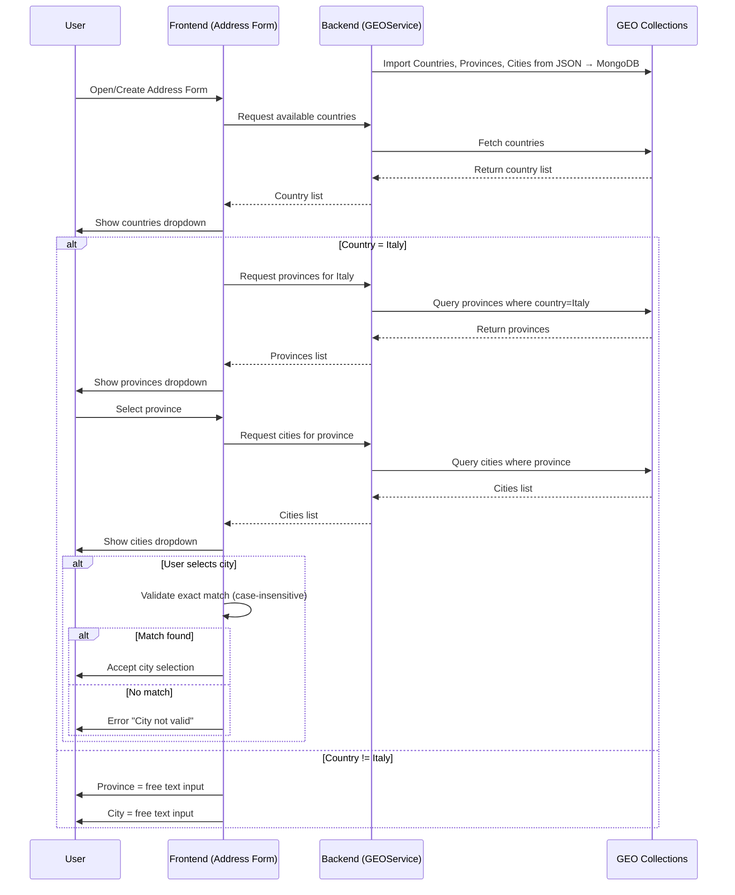

# **Address Form & GEO Data Specification**

---

## **1. Data Source & Collections**

- **Source**: A dedicated service (e.g., `GEOService`) is responsible for **loading**, **managing**, and **serving** geographical data.

### **Collections**

1. **Countries Collection**
   - **Fields**: `id`, `nameIt`, `nameEn`, `ISOcode`, `cargosCode`, `istat`
2. **Provinces Collection**
   - **Fields**: `id`, `name`, `shortCode`, `istat`
3. **Cities Collection**
   - **Fields**: `id`, `name`, `provinceCode`, `cargosCode`, `istat`

---

## **2. Backend Responsibilities**

The backend is split into two distinct services:

- `GEOService`: The **GEOService** is the **single source of truth** for geographical data and exposes GraphQL APIs for managing and retrieving it.
- `The address domain service` (e.g. `CRMService`): Is the service who responsible for **storing, managing, and exposing user-provided addresses**.  
  Unlike `GEOService`, which manages **static reference data** (countries, provinces, cities), `Address Domain Service` handles **dynamic user data**.

### **2.1. `GEOService`**

- **Manages reference data**: countries, provinces, and cities.
- Imports and updates data via **GraphQL mutations**.
- Exposes **GraphQL queries** to fetch and filter geographical data.
- Handles caching and import geo-data validation.

#### **2.1.1 Data Import via GraphQL Mutations**

- The backend provides GraphQL **mutations** to **import and update data**:
  - `importCountries(data: JSON)`: Imports or updates the **countries** collection.
  - `importProvinces(data: JSON)`: Imports or updates the **provinces** collection.
  - `importCities(data: JSON)`: Imports or updates the **cities** collection.
- Data is typically loaded from **external JSON files** and inserted into MongoDB.

#### **2.1.2 Listing & Filtering via GraphQL Queries**

The backend exposes GraphQL **queries** to fetch data dynamically With dynamic filters on all fields:

| **Query**      | **Description**            | **Returns**             |
| -------------- | -------------------------- | ----------------------- |
| `countries`    | Fetch all countries        | List of countries       |
| `provinces`    | Fetch provinces by country | List of provinces       |
| `cities`       | Fetch cities by province   | List of cities          |
| `searchCities` | Search cities by name      | List of matching cities |

---

#### **2.1.3 Caching Strategy**

To improve performance and reduce database load:

- **In-memory caching** (**Redis**) for frequently accessed data:
  - List of **countries** (almost static).
  - List of **provinces** for a given country.
  - List of **cities** for a given province.
- **Cache invalidation**:
  - Whenever new data is imported via **GraphQL mutations**, the cache must be refreshed.
- **Cache TTL** (time-to-live) should be configurable (default: **72 hours**).

---

#### **2.1.4 Error Handling**

The backend must handle and expose clear error responses:

- **Import Errors**:
  - Invalid JSON format → return `BAD_REQUEST`.
  - Missing required fields → return `VALIDATION_ERROR`.
  - Duplicate `id` conflicts → handle gracefully and skip duplicates.

### **2.2. The address domain service (e.g. `CRMService`)**

- **Stores and manages user-provided addresses**.
- Receives: **Structured form data** (see below).
- Persists it for: **Business logic and querying** (structured data).

---

## **3. Structured Address Data Model**

The **frontend** sends the following structured address data to the `The address domain service`:

| **Field**        | **Type** | **Required** | **Description**                                                                                                                          |
| ---------------- | -------- | ------------ | ---------------------------------------------------------------------------------------------------------------------------------------- |
| `address`        | `string` | ✅           | Street name extracted from Google Places or manual input.                                                                                |
| `fullAddress`    | `string` | ✅           | Full formatted address returned by Google Places API OR the same value exists in the `address` field if the the address entered manually |
| `buildingNumber` | `string` | ✅           | Building or house number.                                                                                                                |
| `country`        | `string` | ✅           | The id of the country exists in the `GEOService` database.                                                                               |
| `province`       | `string` | ⛔           | Used if the province exists in the `GEOService` database.                                                                                |
| `provinceText`   | `string` | ⛔           | Used if the province is **not** in the database.                                                                                         |
| `city`           | `string` | ⛔           | Used if the city exists in the `GEOService` database.                                                                                    |
| `cityText`       | `string` | ⛔           | Used if the city is **not** in the database.                                                                                             |
| `postalCode`     | `string` | ✅           | Postal/ZIP code from Google Places or manual entry.                                                                                      |
| `latitude`       | `number` | ⛔           | Optional. Taken from Google Places API when available.                                                                                   |
| `longitude`      | `number` | ⛔           | Optional. Taken from Google Places API when available.                                                                                   |

> **Note:**
>
> - For **Italy**, the frontend **must send IDs** for `province`, and `city` whenever possible.
> - For **non-Italy** addresses, free-text fields (`provinceText`, `cityText`) may be used if exact matches are unavailable.
> - The `fullAddress` field is not displayed to the user.

---

## **4. Address Form Behavior (Frontend)**

### **4.1. Manual Address Entry or Autocomplete Start**

When the user begins filling in the **Address** — either manually or via autocomplete — the behavior depends on the selected **Country**:

#### **If the country is _Italy_:**

- **Province**: Display a **dropdown input field** populated from our database.
- **City**: Display a **dropdown input field** populated from our database.

#### **If the country is _NOT Italy_:**

- **Province**: Display a **free-text input field** instead of a dropdown.
- **City**: Display a **free-text input field** instead of a dropdown.

---

### **4.2. Address Autocomplete Behavior (Frontend)**

Autocomplete is powered by the **Google Places API**.

When the user selects an address suggestion:

- Parse the Google response and **extract the street name only**.
- Show **only the street name** in the **Address input field**.

  **Country Matching**

  - Attempt to match the country **exactly** (case-insensitive) with our database.
  - If no match is found, **leave the field empty and do not pre-fill** province or city.

  **If the detected country is _Italy_:**

  - **Province**:
    - Attempt to match the autocomplete result’s province **exactly** (case-insensitive).
    - If no exact match is found, **leave the field empty and do not pre-fill** city.
  - **City**:
    - Attempt to match the autocomplete result’s city **exactly** (case-insensitive).
    - If no exact match is found, **leave the field empty**.

  **If the detected country is _NOT Italy_:**

  - Pre-fill **province** and **city** as **free text**.

---

## **5. System Flow**

